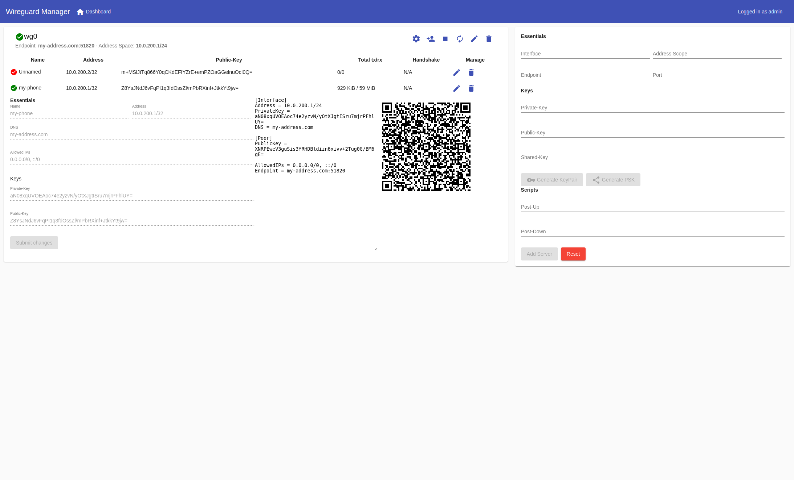
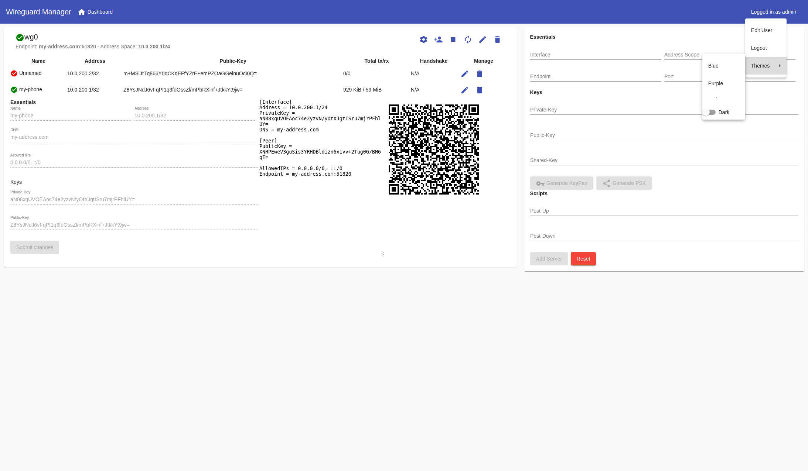
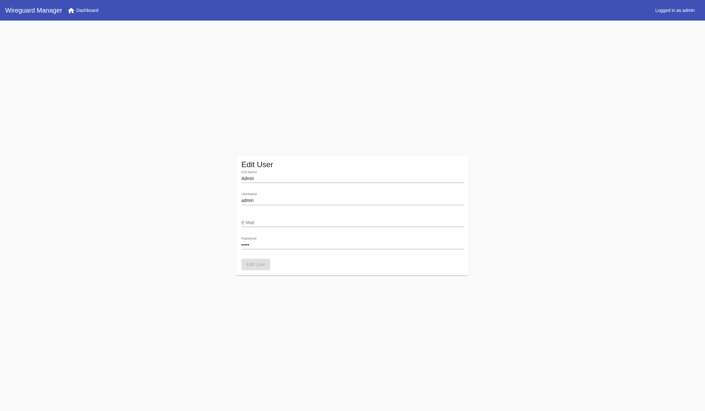

# wg-manager
The wg-manager provides an easy-to-use graphical web interface to import, setup, and manage WireGuard server(s).
[See Here](https://github.com/perara/wg-manager#Showcase)

The features of wg-manager includes:

**Server**
* IPv4 **and** IPv6 support
* Create/Delete/Modify
* Start/Stop/Restart server
* Import existing configurations
* Export server config, along with client config as zip.

**Peer**
* Create/Delete/Modify
* Bandwidth usage statistics
* Export by QRCode, Text
* Authentication via API-Keys for automation (Created in GUI)
* Automatic setup using docker

**General**
* Modify Admin User
* Create and manage API-Keys

# Dependencies
* Linux >= 5.6 *(Alternatively: wireguard-dkms)*

# Common Installation Steps
1. Enable ip forwarding:
     ```
    sysctl -w net.ipv4.ip_forward=1 # IPV4 Support
    sysctl -w net.ipv6.conf.all.forwarding=1  # IPV6 Support
     ```
2. For persistent configuration: 
    ```
    cat > /etc/sysctl.d/99-sysctl.conf << EOF
    net.ipv4.ip_forward = 1
    net.ipv6.conf.all.forwarding=1
    EOF
    ```
3. It is recommended to have a firewall protecting your servers

## Notes
* A few people has experienced issues with running the dockerized method using bridged networking. To fix this, you can use `network_mode: host`. Note that you can no longer reverse-proxy the web interface from reverse proxies such as [jwilder/nginx-proxy](https://hub.docker.com/r/jwilder/nginx-proxy/).

## Method #1: Docker-compose
```yaml
version: "2.1"
services:
  wireguard:
    container_name: wg-manager
    image: perara/wg-manager
    restart: always
    sysctls:
      net.ipv6.conf.all.disable_ipv6: 0  # Required for IPV6
    cap_add:
      - NET_ADMIN
    #network_mode: host # Alternatively
    ports:
       - 51800-51900:51800-51900/udp
       - 8888:8888
    volumes:
      - ./wg-manager:/config
    environment:
      HOST: 0.0.0.0
      PORT: 8888
      ADMIN_PASSWORD: admin
      ADMIN_USERNAME: admin
      WEB_CONCURRENCY: 1
```
or [plain docker here](./docs/guides/docker_configuration.md)

# Method #2: Bare Metal
- [Installation on Debian/Ubuntu/RPI4](./docs/install.md)

# Using the development branch
As there is no builds for the development branch, you have to do the following:
Change `image: perara/wg-manager` to
```
build:
      context: https://github.com/perara/wg-manager.git#dev
```

# Guides
- [Importing Existing configuration](./docs/guides/import_existing_server.md)
- [Reverse Proxy](./docs/guides/reverse_proxy.md)

# Usage
When docker container/server has started, go to http://localhost:8888

# API Docs
The API docs is found [here](./docs/api.md).

# API-Keys
1. Login to wg-manager
2. Go to edit profile
3. Create API-Key and take note of the key. Use the X-API-Key header to authenticate.
4. Example: `curl -i -H "X-API-Key: <key-goes-here>" http://<host>:<port>/api/v1/users/api-key/list`
5. Example 2: `curl -X POST "http://<host>:<port>/api/v1/peer/configuration/add" -H "accept: application/json" -H "Content-Type: application/json" -H "X-API-Key: <api-key-here>" -d "{\"server_interface\":\"wg0\"}"`

# Client Mode
wg-manager can also run in client-mode, with near-automatic setup and connection. To automatically setup the client,
you will need:
1. wg-manager server url
2. name of the interface the client should run on
3. wg-manager server api key

You can setup multiple clients using the numbered environment variables. The following configuration runs a server and client automatically:
```dockerfile
version: "2.1"
services:

  server:
    container_name: wg-manager
    build: .
    restart: always
    sysctls:
      net.ipv6.conf.all.disable_ipv6: 0
    cap_add:
      - NET_ADMIN
    #network_mode: host # Alternatively
    ports:
      - 11820:11820/udp
      - 51800-51900:51800-51900/udp
      - 8888:8888
    environment:
      HOST: 0.0.0.0
      PORT: 8888
      ADMIN_USERNAME: admin
      ADMIN_PASSWORD: admin
      WEB_CONCURRENCY: 2
      SERVER_INIT_INTERFACE_START: 1

      #endpoint dynamic variables: ||external|| , ||internal||
      SERVER_INIT_INTERFACE: '{"address":"10.0.200.1","v6_address":"fd42:42:42::1","subnet":24,"v6_subnet":64,"interface":"wg0","listen_port":"51820","endpoint":"server","dns":"10.0.200.1,8.8.8.8","private_key":"","public_key":"","post_up":"","post_down":"","configuration":"","is_running":false,"peers":[]}'
      SERVER_STARTUP_API_KEY: thisisasecretkeythatnobodyknows
    networks:
      - wg-manager-net

  client:
    container_name: wg-manager-server-with-client
    build: .
    restart: always
    sysctls:
      net.ipv6.conf.all.disable_ipv6: 0
    cap_add:
      - NET_ADMIN
    ports:
      - 8889:8889
    privileged: true
    environment:
      HOST: 0.0.0.0  # Optional (For Accessing WEB-Gui)
      PORT: 8889  # Optional (Web-GUI Listen Port)
      WEB_CONCURRENCY: 1  # Optional
      ADMIN_USERNAME: admin
      ADMIN_PASSWORD: admin
      INIT_SLEEP: 5  # If you run into concurrency issues
      SERVER: 0  # If you want to host a server as well
      CLIENT: 1  # If you want to connect to servers
      CLIENT_START_AUTOMATICALLY: 1  # If you want the client to start automatically
      CLIENT_1_NAME: "client-1"   # Name of first client
      CLIENT_1_SERVER_HOST: "http://server:8888"  # Endpoint of first server
      CLIENT_1_SERVER_INTERFACE: "wg0"  # Interface of first server (to get config)
      CLIENT_1_API_KEY: "thisisasecretkeythatnobodyknows"  # API-Key of first server (to get config)
    networks:
      - wg-manager-net

networks:
  wg-manager-net:
    driver: bridge
```


# Environment variables
| Environment      | Description                                                               | Recommended |
|------------------|---------------------------------------------------------------------------|-------------|
| GUNICORN_CONF    | Location of custom gunicorn configuration                                 | default     |
| WORKERS_PER_CORE | How many concurrent workers should there be per available core (Gunicorn) | default     |
| WEB_CONCURRENCY  | The number of worker processes for handling requests. (Gunicorn)          | 1           |
| HOST             | 0.0.0.0 or unix:/tmp/gunicorn.sock if reverse proxy. Remember to mount    | 0.0.0.0     |
| PORT             | The port to use if running with IP host bind                              | 80          |
| LOG_LEVEL        | Logging level of gunicorn/python                                          | info        |
| ADMIN_USERNAME   | Default admin username on database creation                               | admin       |
| ADMIN_PASSWORD   | Default admin password on database creation                               | admin       |
| POST_UP          | The POST_UP Command (version 4)                                           | default     |
| POST_DOWN        | The POST_DOWN Command (version 4)                                         | default     |
| POST_UP_V6       | The POST_UP Command (version 6)                                           | default     |
| POST_DOWN_V6     | The POST_DOWN Command (version 6)                                         | default     |
| INIT_SLEEP       | Sleep before bootstrap. Useful for delaying client boot                   | integer     |
| SERVER_STARTUP_API_KEY | Create a initial, and known API key on server init                  | secret      |
| SERVER_INIT_INTERFACE | Create a initial wireguard interface on server init. See docs        | json        |
| SERVER_INIT_INTERFACE_START | If the interface should start immediately                      | 1 or 0      |
| SERVER | If the container should enable server-mode                                          | 1 or 0      |
| CLIENT | If the container should enable client-mode                                          | 1 or 0      |
| CLIENT_START_AUTOMATICALLY | If client is enabled. should it start immediately?              | 1 or 0      |
| CLIENT_X_NAME | Name of the automatically generated client. X = incremental number from 1    | string      |
| CLIENT_X_SERVER_HOST | The url to wg-manager server e.g. "http://server:8888"  See docs      | url         |
| CLIENT_X_SERVER_INTERFACE | The wg-interface to create client on e.g"wg0". See docs          | string      |
| CLIENT_X_API_KEY | A valid API-Key that is active on the server. Works well with SERVER_STARTUP_API_KEY | string |

# Q&A
I'm trying to start the device but recieve the message: `Perhaps ip6tables or your kernel needs to be upgraded.`.
    Try: `modprobe ip6table_nat` on the host.

# Showcase









# Roadmap
### Primaries
- Implement multi-server support (setting up site-2-site servers from the GUI)
- Extending multi-server support to enable custom access lists (A peer can be assigned to multiple servers, as part of the ACL)

